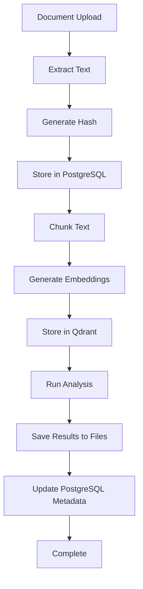
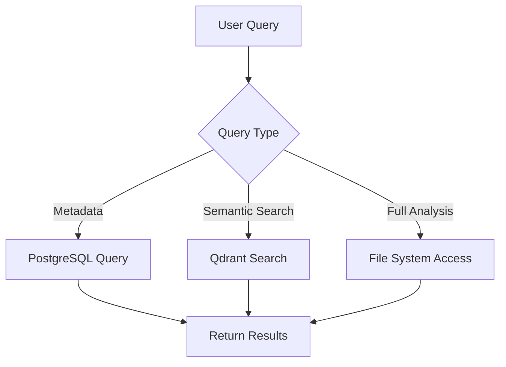

# Hybrid Storage Strategy for Legal Document Analysis

## Overview

This document outlines the recommended hybrid storage architecture for legal organizations that need to index, analyze, and query large volumes of documents. The strategy combines multiple storage technologies to optimize for different use cases while ensuring compliance, performance, and scalability.

## Architecture Components

### 1. PostgreSQL Database (Metadata & Relationships)

**Purpose**: Structured data storage, relationships, and fast queries

**Stores**:
- Document metadata (filename, upload date, client, case number)
- Analysis results summary and status
- User permissions and access control
- Audit trails and compliance data
- Document relationships and references

**Benefits**:
- ACID compliance for data integrity
- Complex queries and joins
- User authentication and authorization
- Transaction support
- Backup and recovery capabilities

**Schema Example**:
```sql
-- Documents table
CREATE TABLE documents (
    document_id UUID PRIMARY KEY,
    filename VARCHAR(255) NOT NULL,
    client_id VARCHAR(100),
    case_number VARCHAR(100),
    upload_date TIMESTAMP DEFAULT NOW(),
    file_hash VARCHAR(64) UNIQUE,
    file_size BIGINT,
    analysis_status VARCHAR(20) DEFAULT 'pending'
);

-- Analysis results metadata
CREATE TABLE analysis_results (
    analysis_id UUID PRIMARY KEY,
    document_id UUID REFERENCES documents(document_id),
    analysis_type VARCHAR(50),
    confidence_score FLOAT,
    created_at TIMESTAMP DEFAULT NOW(),
    analyst_id VARCHAR(100),
    file_path TEXT,
    status VARCHAR(20) DEFAULT 'completed'
);
```

### 2. Qdrant Vector Database (Semantic Search)

**Purpose**: Semantic search, similarity matching, and cross-document analysis

**Stores**:
- Document text chunks as high-dimensional vectors
- Embeddings for semantic similarity
- Metadata for filtering search results
- Document relationships based on content similarity

**Benefits**:
- Fast semantic search across large document collections
- Similar document discovery
- Cross-document analysis and pattern recognition
- Legal precedent matching
- Clause similarity detection

**Usage Examples**:
```python
# Store document chunks as vectors
qdrant_client.upsert(
    collection_name="legal_documents",
    points=[
        PointStruct(
            id=chunk_id,
            vector=embedding,
            payload={
                "document_id": doc_id,
                "chunk_text": text_chunk,
                "chunk_type": "clause",
                "client_id": client_id
            }
        )
    ]
)

# Semantic search for similar clauses
results = qdrant_client.search(
    collection_name="legal_documents",
    query_vector=query_embedding,
    query_filter={"client_id": "ABC-Corp"},
    limit=10
)
```

### 3. File-Based Storage (Complete Analysis Results)

**Purpose**: Immutable storage of complete analysis results for compliance and audit trails

**Stores**:
- Full JSON analysis results
- Generated reports (PDF, Word, Excel)
- Document versions and backups
- Compliance archives
- Export files

**Benefits**:
- Compliance with legal requirements (SOX, GDPR, HIPAA)
- Immutable audit trails
- Easy sharing and distribution
- Version control capabilities
- Cost-effective storage for large content
- Integration with existing legal workflows

**File Organization Strategy**:
```
/legal-data/
├── active/
│   ├── 2024/
│   │   ├── 01/
│   │   │   ├── 15/
│   │   │   │   ├── ABC-Corp-NDA-analysis-a1b2c3d4.json
│   │   │   │   └── XYZ-Inc-contract-analysis-e5f6g7h8.json
│   │   │   └── 16/
│   │   └── 02/
│   └── 2023/
├── archive/
│   ├── 2022-analyses.zip
│   └── 2021-analyses.zip
├── reports/
│   ├── compliance/
│   └── summaries/
└── exports/
    ├── client-deliverables/
    └── court-submissions/
```

## Data Flow Architecture

### Document Processing Pipeline



### Query Processing Flow



## Implementation Phases

### Phase 1: PostgreSQL Integration
- [ ] Set up PostgreSQL database
- [ ] Create document and analysis metadata tables
- [ ] Implement CRUD operations for documents
- [ ] Add user authentication and authorization
- [ ] Migrate existing document cache to PostgreSQL

### Phase 2: Qdrant Vector Storage
- [ ] Set up Qdrant vector database
- [ ] Implement text chunking and embedding generation
- [ ] Create vector storage for document chunks
- [ ] Implement semantic search functionality
- [ ] Add similarity-based document recommendations

### Phase 3: File-Based Storage
- [ ] Design hierarchical file organization system
- [ ] Implement file path generation logic
- [ ] Create analysis result serialization
- [ ] Add file-based storage for complete results
- [ ] Implement file versioning and archiving

### Phase 4: Batch Processing
- [ ] Design batch processing queue system
- [ ] Implement parallel document analysis
- [ ] Add progress tracking and status updates
- [ ] Create batch analysis API endpoints
- [ ] Add error handling and retry logic

### Phase 5: Advanced Features
- [ ] Implement cross-document analysis
- [ ] Add compliance reporting capabilities
- [ ] Create document similarity dashboards
- [ ] Implement automated analysis scheduling
- [ ] Add integration with external legal tools

## Storage Layer Responsibilities

### PostgreSQL Responsibilities
- Document metadata and relationships
- User management and permissions
- Analysis status tracking
- Audit logs and compliance data
- Fast metadata queries and filtering

### Qdrant Responsibilities
- Document content embeddings
- Semantic search and similarity
- Cross-document analysis
- Pattern recognition and insights
- Content-based recommendations

### File System Responsibilities
- Complete analysis result storage
- Report generation and storage
- Document versioning and archiving
- Compliance and audit trail preservation
- Easy data export and sharing

## Performance Considerations

### Scalability Metrics
- **PostgreSQL**: Up to millions of document records
- **Qdrant**: Billions of vector embeddings
- **File System**: Organized to avoid Windows 100K file limit per folder

### Optimization Strategies
- **Database Indexing**: Optimize queries on frequently accessed fields
- **Vector Caching**: Cache frequently accessed embeddings
- **File Compression**: Compress archived analysis results
- **CDN Integration**: Use CDN for frequently accessed reports

### Monitoring and Maintenance
- **Database Performance**: Monitor query performance and optimize indexes
- **Vector Search**: Track search latency and accuracy
- **File Storage**: Monitor disk usage and implement cleanup policies
- **Backup Strategy**: Regular backups of all storage layers

## Compliance and Security

### Data Retention
- **Active Analysis**: 2 years in file system
- **Archived Analysis**: Compressed archives for 7+ years
- **Metadata**: Permanent retention in PostgreSQL
- **Vectors**: Retained for search functionality

### Security Measures
- **Encryption**: Encrypt sensitive analysis results
- **Access Control**: Role-based permissions across all layers
- **Audit Logging**: Complete audit trail of all operations
- **Data Integrity**: Checksums and validation for all stored data

### Legal Compliance
- **SOX Compliance**: Immutable audit trails
- **GDPR Compliance**: Data retention and deletion policies
- **HIPAA Compliance**: Secure handling of sensitive information
- **Legal Hold**: Ability to preserve data for litigation

## Cost Analysis

### Storage Costs (Estimated)
- **PostgreSQL**: $50-200/month for metadata storage
- **Qdrant**: $100-500/month for vector storage
- **File Storage**: $10-50/month for analysis results
- **Total**: $160-750/month for enterprise-scale deployment

### Operational Benefits
- **Reduced Analysis Time**: Cached results eliminate re-analysis
- **Improved Search**: Semantic search across document portfolio
- **Compliance Efficiency**: Automated audit trail generation
- **Scalability**: Handle growing document volumes efficiently

## Migration Strategy

### From Current System
1. **Phase 1**: Migrate document metadata to PostgreSQL
2. **Phase 2**: Generate embeddings for existing documents
3. **Phase 3**: Archive existing analysis results to file system
4. **Phase 4**: Implement new hybrid storage for new analyses
5. **Phase 5**: Gradually migrate remaining data

### Data Migration Tools
- **Database Migration**: Alembic for PostgreSQL schema changes
- **Vector Migration**: Custom scripts for Qdrant data migration
- **File Migration**: Batch processing for file system organization

## Conclusion

The hybrid storage strategy provides a robust, scalable, and compliant solution for legal document analysis. By combining the strengths of PostgreSQL (structured data), Qdrant (semantic search), and file-based storage (compliance), organizations can efficiently manage large document portfolios while meeting legal and regulatory requirements.

This architecture supports both current needs and future growth, providing the foundation for advanced legal analytics and compliance automation.
