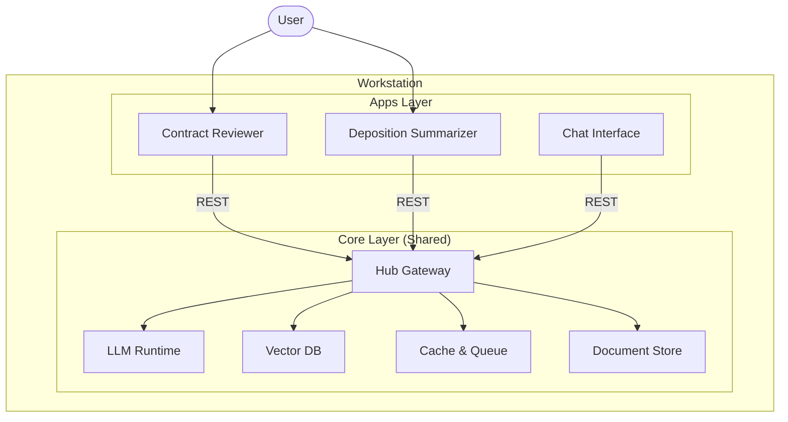
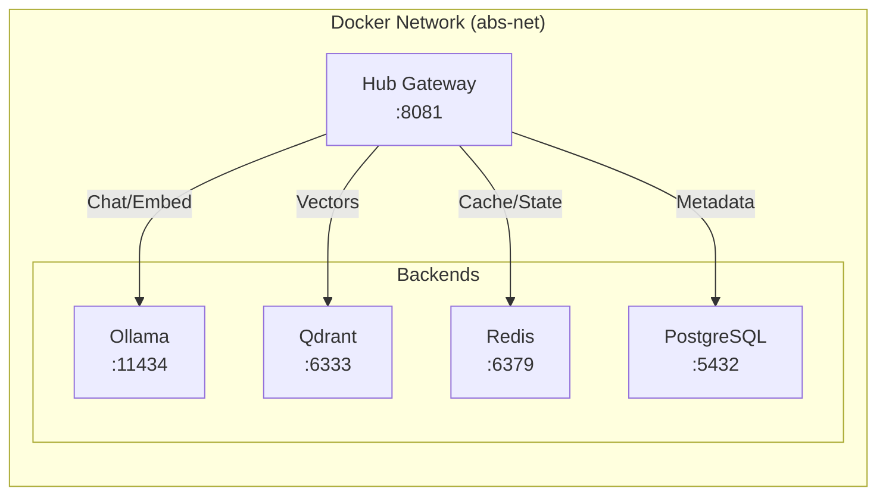

# Architecture and Component View: ABS AI Hub Core Services

This document provides a high-level architectural view of the ABS AI Hub "Core", focusing on the structural containers and the internal components of the Gateway.

---

## 1. System Context

The **Core** acts as the shared infrastructure layer for all AI applications running on the workstation. It abstracts away the complexity of managing AI models, vector databases, and caching.



---

## 2. Container Architecture

The Core is composed of several Docker containers running in a shared network (`abs-net`). The **Hub Gateway** is the primary entry point.

| Container | Image | Purpose |
| :--- | :--- | :--- |
| **abs-hub-gateway** | `python:3.11-slim` | Orchestrator, API Facade, Auto-wake Manager. |
| **abs-ollama** | `ollama/ollama` | Local LLM inference engine (Llama 3, etc.). |
| **abs-qdrant** | `qdrant/qdrant` | Vector database for semantic search. |
| **abs-redis** | `redis:alpine` | Semantic caching and message queue. |
| **document-hub-postgres**| `postgres:15` | Relational storage for document metadata. |
| **abs-onyx** | *(Optional)* | Advanced RAG/Agentic runtime. |

### Diagram



---

## 3. Component View: Hub Gateway

The **Hub Gateway** is a Python FastAPI application refactored into a modular architecture.

### Internal Structure

```mermaid
classDiagram
    class App {
        +FastAPI app
        +Startup/Shutdown events
    }
    
    namespace Routers {
        class Chat["chat.py"] {
            +POST /v1/chat/completions
            +POST /v1/embeddings
            +GET /v1/models
        }
        class Ops["ops.py"] {
            +GET /admin/system/metrics
            +POST /admin/services/control
        }
        class Assets["assets.py"] {
            +GET /catalog
        }
        class Inspector["inspector.py"] {
            +GET /admin/inspector/{id}
        }
    }

    namespace Services {
        class AutoWake["autowake.py"] {
            +ensure_service_ready()
            +idle_monitor_task()
            +check_idle_models()
        }
        class DockerService["docker_service.py"] {
            +get_container()
            +start/stop()
        }
        class TriStore["trstore.py"] {
            +analyze_consistency()
        }
    }

    namespace Config {
        class Configuration["config.py"]
        class Registry["registry.json"]
    }

    App --> Routers
    Routers --> Services
    Services --> DockerService
    Services --> Config
    Routers --> Config
```

### Key Components

1.  **Routers (`/routers`)**:
    *   **Chat**: Unified API for LLM interactions. Automatically routes to Ollama or OpenAI-compatible providers.
    *   **Ops**: System administration, service control, and resource monitoring.
    *   **Inspector**: Diagnostic tool to verify data consistency across Postgres, Redis, and Qdrant.

2.  **Services (`/services`)**:
    *   **AutoWake**: The "brain" of resource management. Monitors activity and sleeps/wakes services and models on demand.
    *   **DockerService**: Abstraction layer for Docker Engine API interactions.
    *   **TriStore**: Logic for cross-checking data integrity across the three major data stores.

3.  **Configuration (`config.py`, `registry.json`)**:
    *   **Config**: Environment variables and static settings.
    *   **Registry**: Dynamic mapping of Apps to their allowed Models and Policies.

---

## 4. Key Workflows

### 4.1. Intelligent Request Routing (Auto-Wake)

1.  **Request**: App sends `POST /v1/chat/completions`.
2.  **Check**: `chat.py` checks if the required provider (e.g., Ollama) is running via `autowake.py`.
3.  **Action**:
    *   If **Running**: Proceed.
    *   If **Stopped**: `autowake.py` triggers `docker_service` to start the container.
4.  **Forward**: Request is forwarded to the backend.
5.  **Monitor**: Background task tracks "last used" time for Idle Sleep.

### 4.2. Tri-Store Inspection

1.  **Request**: Admin checks document health `GET /admin/inspector/{doc_id}`.
2.  **Fetch**: `trstore.py` fetches raw data from Postgres, Vectors from Qdrant, and Cached chunks from Redis.
3.  **Analyze**: Computes checksums and compares states.
4.  **Report**: Returns a consistency report (e.g., "Missing vectors for Document X").
